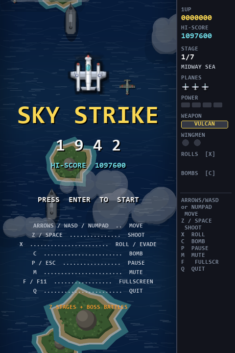
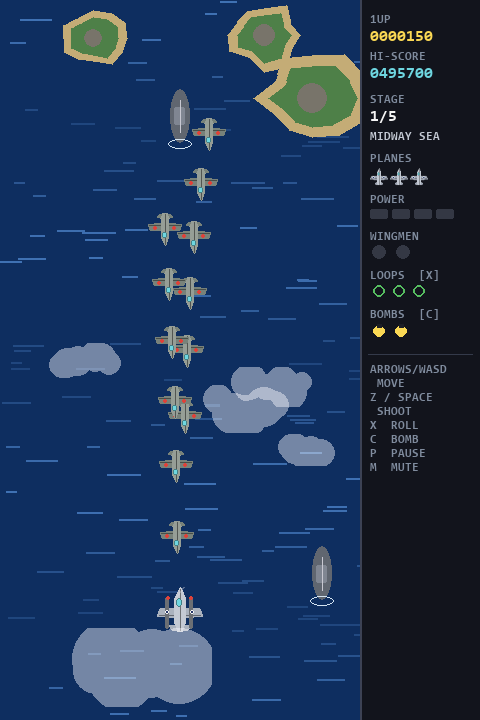
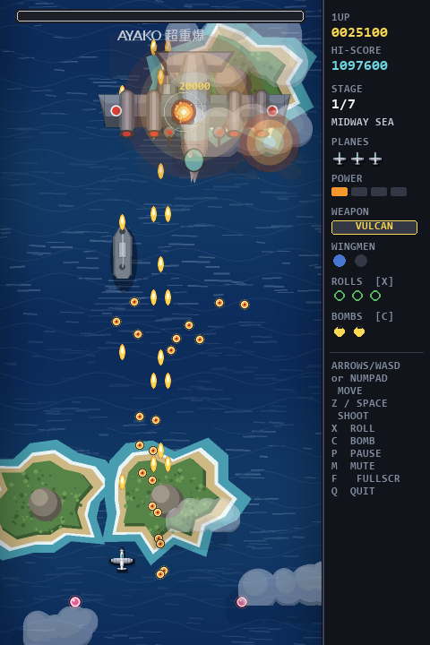

# ✈️ Sky Strike 1942

以 **Python + Pygame** 打造的垂直捲軸射擊遊戲（shoot 'em up），玩法向 CAPCOM 經典《1942》致敬：
編隊敵機、POW 道具、**翻滾迴避（loop-the-loop）**、**機砲 / 穿透雷射雙武器**、多關卡與巨型頭目戰。

所有圖形與音效都是**程式即時產生**的（沒有任何外部素材檔），整個遊戲只依賴 `pygame-ce`。

| 標題畫面 | 關卡進行 | 頭目戰 |
|---|---|---|
|  |  |  |

---

## 🚀 執行方式

### 方法 1：一鍵啟動（推薦）

```powershell
.\run.ps1
```

腳本會自動用 `uv` 建立 `.venv`、安裝 `pygame-ce`，然後啟動遊戲。
（雙擊執行請用 `run.bat`；失敗時視窗會停住並顯示錯誤訊息。）

只想確認環境是否正常（開視窗 4 秒後自動關閉）：

```powershell
.\run.ps1 -SelfCheck
```

### 方法 2：手動

```powershell
uv venv
uv pip install -r requirements.txt
.\.venv\Scripts\python.exe main.py
```

或使用一般 pip：

```powershell
python -m venv .venv
.\.venv\Scripts\pip install -r requirements.txt
.\.venv\Scripts\python main.py
```

> 需求：Python 3.10 以上、`pygame-ce >= 2.5`。

---

## 🎮 操作

| 按鍵 | 功能 |
|------|------|
| `↑ ↓ ← →` / `W A S D` / **數字鍵盤** | 移動 |
| `Z` / `Space` / `J` / `Num 0` | 射擊（可壓著連射） |
| `X` / `Shift` / `K` | **翻滾迴避**：0.9 秒無敵，每次消耗 1 次 |
| `C` / `L` | 炸彈：清除全畫面敵彈並重創敵機 |
| `P` / `Esc` | 暫停 |
| `M` | 靜音切換 |
| `F11` | 全螢幕切換（畫面等比放大並置中） |
| `Q` | **離開遊戲**（遊戲中會先詢問確認） |
| `Enter` | 標題畫面開始 / 結束後回標題 |

> **數字鍵盤**：`8 2 4 6` 對應上下左右（`5` 同樣是「下」），
> `7 9 1 3` 為四個對角方向，`0` 為射擊。需開啟 NumLock。

> **離開遊戲**：遊戲進行中按 `Q` 會跳出 `QUIT GAME?` 確認畫面，
> 按 `Y` / `Enter` 離開、`N` / `Esc` 取消，避免誤按直接結束。
> 在標題畫面按 `Q` 則直接離開。

> **全螢幕**：採無邊框視窗鋪滿桌面，畫面會**等比放大並置中**（上下或左右留黑邊），
> 不會偏向畫面左側，也不會變形。

> **視窗焦點**：遊戲啟動時會自動置中桌面、帶到最前面並取得鍵盤焦點。
> 若切換到其他視窗，遊戲會自動暫停並顯示 `NO KEYBOARD FOCUS`，
> 此時滑鼠指標會恢復顯示，**點一下遊戲視窗**即可繼續操作。

---

## 🕹️ 遊戲系統

### 關卡

共 **5 關**，每關結尾都有專屬頭目。全部通關後會進入 **ALL STAGES CLEAR 結局畫面**（結算 All Clear 獎勵與最終分數），**不會再從第 1 關重跑**；按 ENTER 回到標題畫面。

| # | 關卡 | 主題 | 頭目 |
|---|------|------|------|
| 1 | MIDWAY SEA | 太平洋海域 | AYAKO 超重爆 |
| 2 | CORAL ISLES | 珊瑚群島 | SHINDEN 空中要塞 |
| 3 | NIGHT RUN | 夜戰海域 | KUROTSUKI 夜戰母機 |
| 4 | DESERT LINE | 沙漠前線 | SANDSTORM 陸上戰艦 |
| 5 | IRON FORTRESS | 鋼鐵要塞 | OMEGA 要塞核心 |

### 武器

| 武器 | 特性 |
|------|------|
| **VULCAN**（預設機砲） | 射速快、彈幕廣，命中即消失；火力愈高散射角度愈大 |
| **LASER**（雷射） | **只有一道正前方光束、不散射**，但可**貫穿**整條敵機縱列；單發傷害 `3 + 火力/2`，射速較慢 |

- 撿到 **Z** 道具切換成雷射，撿到 **V** 道具切回機砲；撿到與目前相同的武器道具會直接加分。
- 火力等級不會增加雷射的數量，只會提高單發傷害與光束粗細。
- 僚機會跟著切換武器（雷射狀態下僚機射出小型光束，威力與機砲相同、不穿透）。
- 被擊墜後武器會回復成 VULCAN。
- 右側面板 `WEAPON` 欄會顯示目前武器。

### 道具（擊墜整組編隊才會掉落）

| 圖示 | 效果 |
|------|------|
| **P** | 火力提升（共 4 階，最高 9 發散射） |
| **W** | 增加僚機（最多 2 架，跟隨並同步射擊）—— 全遊戲共 15 處掉落，最容易取得 |
| **Z** | 切換為穿透雷射 |
| **V** | 切換回散射機砲 |
| **B** | 炸彈 +1（最多 4） |
| **L** | 翻滾次數 +2 |
| **1UP** | 增加 1 台備用機（**已不再由編隊掉落**，只能靠分數 extend 取得） |

### 其他規則

- 起始 3 台備用機，每 80,000 分獎勵 1 台（加命刻意設計得相當稀有）。
- 被擊中會失去火力、僚機與雷射（經典街機規則）。
- 過關可獲得 `5000 × 關卡數 + 剩餘機數 × 2000` 的通關獎勵。
- 全破可額外獲得 `50,000 + 剩餘機數 × 10,000` 的 ALL CLEAR 獎勵。
- 最高分數會存放在 `%APPDATA%\SkyStrike1942\highscore.txt`。

---

## 🧱 專案結構

```text
sky-strike-1942/
├── main.py                 進入點（初始化視窗與 mixer）
├── game/
│   ├── settings.py         全域常數（畫面、速度、顏色）
│   ├── utils.py            小工具與最高分存讀
│   ├── audio.py            程式合成的音效與 chiptune 背景音樂
│   ├── gfx.py              程式繪製的機體 / 子彈 / 道具 / 爆炸圖
│   ├── background.py       無縫捲動背景（海洋、島嶼、夜戰、沙漠、要塞）
│   ├── entities.py         玩家、僚機、敵機、頭目、子彈、道具、特效
│   ├── stages.py           5 關的波次腳本與頭目設定
│   ├── hud.py              右側資訊面板與畫面文字
│   └── app.py              主迴圈、狀態機、碰撞、生成器
├── tests/
│   ├── smoke_test.py       無視窗煙霧測試（跑完 5 關 + 頭目 + Game Over）
│   └── input_test.py       輸入測試（移動 / 數字鍵盤 / 射擊 / 全螢幕置中 / 離開 / 焦點）
└── tools/
    ├── screenshot.py       無視窗截圖工具
    ├── bench.py            效能量測
    ├── input_check.py      真實視窗輸入診斷（按鍵、焦點、FPS）
    └── window_check.py     真實視窗 / 音效裝置自我檢查
```

### 敵機移動模式

`stages.py` 以資料描述波次，可用的 `pattern` 有：
`down`（直線下降）、`sine`（蛇行）、`dive`（俯衝追擊）、`arc`（弧線繞行）、
`swoop`（下降後橫向掃過）、`hover`（滯空射擊後離場）、`sidesweep`（側邊切入）、
`zigzag`（折線）。

新增波次只要在對應關卡的 `waves` 加一行 `wave(...)` 即可。

---

## ✅ 驗證

```powershell
# 無視窗跑完 5 關、頭目戰、道具、炸彈、死亡與 Game Over 流程
.\.venv\Scripts\python.exe tests\smoke_test.py

# 輸入測試：移動、射擊、死亡重生後、事件驅動備援、視窗焦點
.\.venv\Scripts\python.exe tests\input_test.py

# 效能量測（最終關重載場景）
.\.venv\Scripts\python.exe tools\bench.py

# 實際開視窗 4 秒，檢查顯示 / 音效裝置與 FPS
.\.venv\Scripts\python.exe tools\window_check.py
```

實測（Python 3.14 + pygame-ce 2.5.7）：每幀 CPU 約 0.8 ms（p95 1.3 ms），
同時 200+ 精靈仍有充足餘裕；實際視窗執行穩定 60 FPS。

---

## 🛠️ 疑難排解

**按鍵沒反應（不能移動 / 不能射擊）**

多半是遊戲視窗沒有鍵盤焦點（例如視窗被主控台或其他程式擋在後面）。
本專案已針對此情況處理：

- 啟動時自動把遊戲視窗帶到最前面並取得焦點
- 一旦失去焦點會自動暫停，畫面顯示 `NO KEYBOARD FOCUS`，並恢復滑鼠指標
- **點一下遊戲視窗**即可立刻恢復操作

若仍有問題，可用診斷工具即時觀察按鍵與焦點狀態：

```powershell
.\.venv\Scripts\python.exe tools\input_check.py 20
```

輸出的 `held=`（key.get_pressed）、`keydown=`（事件）、`focus=`（鍵盤焦點）
可判斷按鍵是否真的送達遊戲。

---

## 📝 備註

- 本遊戲為原創程式與原創美術（全部由程式繪製），僅在玩法上向 1942 類型致敬，未使用任何原作素材。
- 若電腦沒有音效裝置，遊戲會自動以靜音模式執行。
